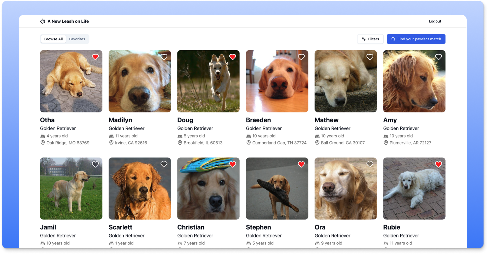

# A New Leash on Life - Dog Adoption Platform

A web application for browsing and matching with adoptable dogs.

## Live Demo

<a href="https://new-leash-on-life.vercel.app" target="_blank" rel="noopener noreferrer">🌐 Visit A New Leash on Life</a>

**Demo Authentication**
- Use any name and email combination to log in (no account creation required)
- Sessions expire after one hour for security - simply log in again if needed

## ⚠️ IMPORTANT: Safari Users (macOS & iOS)

**This app requires cross-site cookies to work.** Safari's Intelligent Tracking Prevention blocks these cookies by default, causing authentication to fail after login.

### macOS Safari Setup (Required)
1. Open **Safari → Settings** (or press `⌘,`)
2. Go to **Privacy** tab
3. **Uncheck** "Prevent cross-site tracking"
4. **Quit Safari completely** (Safari → Quit Safari or `⌘Q`)
5. Reopen Safari and visit the site
6. Log in

### iOS Safari Setup (Required)
1. Open **Settings** on your iPhone/iPad
2. Scroll to **Safari**
3. Under "Privacy & Security":
   - Turn **OFF** "Prevent Cross-Site Tracking"
   - Turn **OFF** "Block All Cookies"
4. **Force quit Safari** (swipe up from bottom, swipe Safari app away)
5. Reopen Safari and visit the site
6. Log in

### iOS Chrome Setup (Required)
1. Open **Chrome** on your iPhone/iPad
2. Tap the three dots (⋮) → **Settings**
3. Tap **Content Settings** → **Block Third-party Cookies**
4. Turn **OFF**
5. Reopen Chrome and visit the site
6. Log in

**Why is this necessary?** The app uses cookie-based authentication with a separate API domain (`frontend-take-home-service.fetch.com`). Safari's Intelligent Tracking Prevention (ITP) blocks these "third-party" cookies for privacy protection, which prevents the app from staying authenticated after login.

**What happens if I don't change these settings?** You'll be able to log in, but the search page will show errors or infinite loading because API requests won't include authentication cookies.

## Screenshot



## Features Built
- **User Authentication**: Secure login with name/email validation
- **Search & Filtering**: Filter dogs by breed, age range, and location
- **Smart Sorting**: Multiple sort options (breed, name, age) with ascending/descending order
- **Pagination**: Efficient browsing through large datasets
- **Favorites System**: Heart/unheart dogs to build a favorites list
- **Matching**: Generate matches based on favorited dogs
- **Responsive Design**: Mobile-first design with smooth animations
- **Real-time Location Data**: Enriched location information for each dog

## Technical Highlights
- React + TypeScript for type safety
- TanStack Query for efficient data fetching and caching
- React Router v7 for modern routing
- Radix UI + Tailwind for accessible components
- Framer Motion for smooth animations
- Form validation with React Hook Form + Zod

## Browser Compatibility

**Desktop**: Works best in Chrome, Firefox, or Safari

**Mobile**: Requires cookie settings changes on iOS (see warning above). Android browsers work without configuration.

## Prerequisites

Before you begin, ensure you have the following installed:

- [Node.js](https://nodejs.org/) (version 16 or higher)
- [npm](https://www.npmjs.com/) (usually comes with Node.js)

## Installation

1. Clone the repository:

```
git clone https://github.com/Joewebsta/new-leash-on-life.git
```

2. Navigate to the project directory:

```
cd new-leash-on-life
```

3. Install dependencies:

```
npm install
```

## Running the Application

To start the development server:

```
npm run dev
```

The application will be available at `http://localhost:5173` (or another port if 5173 is in use).
